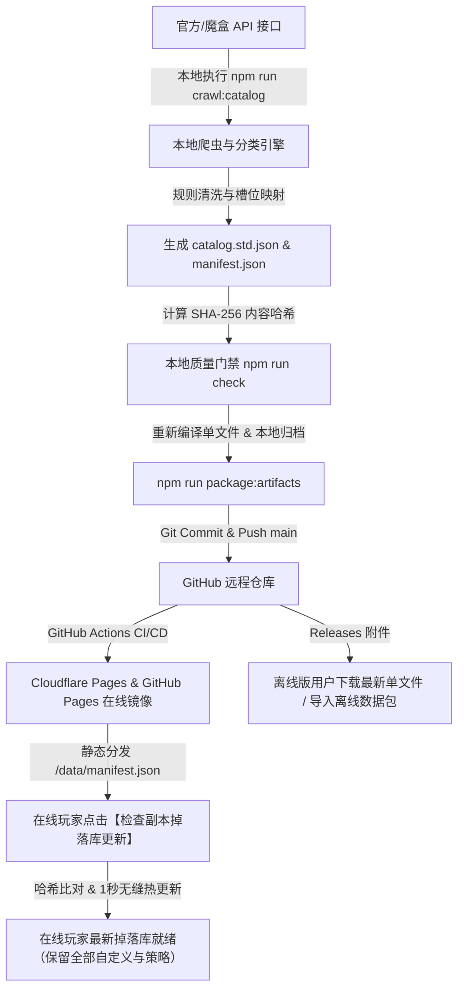

# 剑网3掉落工坊 · 数据包更新与全域分发流程规范

本文档详细说明《剑网3掉落工坊》副本掉落数据库（Catalog Data Pack）的本地爬取、数据清洗、质量校验、Git 提交推送以及线上全域热更新的完整闭环流程。

---

## 1. 架构设计与核心原理 (Architecture & Design)

工坊的数据更新体系采用 **「本地预爬取与深度清洗 ➔ 静态镜像托管 ➔ 客户端秒级热更新」** 模式：



### 为什么不让玩家浏览器直接请求第三方原始 API？
1. **跨域（CORS）与高频风控**：全量 254 副本、981 Boss 需并发数百次请求，前端直连会被跨域拦截，且海量玩家请求极易触发第三方防爬风控导致 IP 被封禁。
2. **繁重的清洗与分类算法**：原始数据包含大量杂项与同名道具，必须通过本地 Node 引擎进行大铁/小铁/牌子识别与槽位归类，预清洗后打包可实现玩家端 0 延迟秒开。
3. **数据一致性与 SHA-256 防篡改**：由站长统一完成校验与哈希签名，确保全网玩家使用的数据 100% 稳定可靠。

---

## 2. 数据版本体系与三核心产物 (Data Artifacts)

每次数据包更新会产生 3 个核心文件：

| 文件路径 | 说明 | 体积 | 用途 |
| :--- | :--- | :---: | :--- |
| `web/src/catalog/catalog.std.json` | 编译期内嵌包 | ~9.3 MB | 供 Vite 编译为离线单文件 `剑网3掉落工坊.html` 内置使用 |
| `web/public/data/catalog.std.json` | 在线完整数据包 | ~9.3 MB | 静态托管于在线站点，供在线玩家热更新下载 |
| `web/public/data/manifest.json` | 版本清单探针 | ~680 B | 记录版本号、SHA-256 哈希、统计指标与下载路径 |

> **版本号命名规则**：`YYYYMMDD-hash`（例如 `20260823-011b26367022`），数据版本与产品软件版本（如 `v1.2.2`）独立演进。

---

## 3. 本地数据包更新标准操作流程 (Local Update SOP)

当游戏开放新赛季、新增副本或魔盒数据有重大订正时，按以下步骤执行：

### 步骤 1：执行全量爬取与智能清洗
在项目根目录运行爬虫命令：
```powershell
npm --prefix web run crawl:catalog
```
- 脚本自动连接魔盒 API，以并发受控（Concurrency=4）及指数退避策略遍历全量副本与掉落；
- 自动套用 `type-label-rules.json` 执行物品分类、装备部位映射与去重；
- 自动计算 SHA-256 全局哈希并同步生成上述 3 个核心产物。

*(注：如果仅调整本地分类规则而无需重新网络爬取，可运行 `npm --prefix web run reclassify:catalog`)*

### 步骤 2：同步元数据中的 catalogVersion
检查 `web/public/data/manifest.json` 中生成的 `catalogVersion`，同步更新至根目录 `VERSION.json`：
```json
{
  "catalogVersion": "20260830-xxxxxx"
}
```

### 步骤 3：执行质量门禁与离线单文件重构
数据包更新后，必须执行全量验证与单文件编译：
```powershell
npm run check
npm run package:artifacts
```
- 验证类型检查、Lint 与所有单元测试（含 `catalog.test.ts` 完整性断言）100% 通过；
- 重新生成内嵌最新数据的离线单文件 `剑网3掉落工坊.html`；
- 生成最新的本地发布归档压缩包。

---

## 4. 提交至 GitHub 与全域自动分发 (Git & Global Deployment)

### 步骤 4：Git 规范提交与推送
```powershell
git add .
git commit -m "data(catalog): update dungeon drops snapshot to 20260830-xxxxxx"
git push origin main
```

### 步骤 5：全域分发生效机制（全自动）

1. **在线镜像站（Cloudflare Pages / GitHub Pages）**：
   - GitHub Actions 监测到 `main` 分支推送，自动触发 Web 静态打包与部署；
   - 部署完成后，`https://jx3-loot-forge.pages.dev/data/manifest.json` 与 `catalog.std.json` 即时更新上线。

2. **在线玩家热更新生效（零丢配置）**：
   - 在线玩家进入工坊或点击 **【检查副本掉落库更新】**；
   - 前端自动请求 680 字节的 `manifest.json` 比对哈希；
   - 发现新哈希后弹窗提示，玩家点击确认后 1 秒拉取新数据包写入 IndexedDB；
   - **完全保留玩家已配置的所有拾取/出售策略、自定义物品与收藏范围**，实现平滑无缝热更新。

3. **离线单文件玩家同步**：
   - 随下一次 GitHub Release 发布，离线单文件直接内置最新数据包；
   - 离线玩家也可在在线版下载最新 `catalog.std.json` 后，在本地单文件内点击 **【导入离线数据包】** 完成本地升级。

---

## 5. 一键更新辅助流水线 (One-Click Script)

为了进一步简化日常操作，可在本地 PowerShell 中直接执行以下一键流水线：

```powershell
# 一键完成：爬取 -> 检查 -> 编译单文件 -> 归档
npm --prefix web run crawl:catalog; npm run check; npm run package:artifacts
```

随后核对 `git status` 并执行推送即可完成全域上线。
